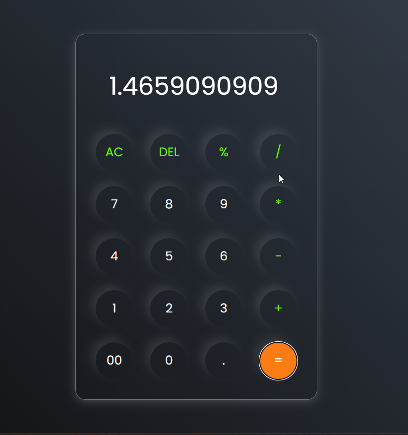

# 🧮 Simple Calculator Web App

A clean, responsive, and interactive calculator built using **HTML**, **CSS**, and **JavaScript**. This project evaluates basic arithmetic expressions using the `math.js` library and provides standard calculator functionalities like `AC`, `DEL`, `+`, `-`, `*`, `/`, and `%`.

## 📌 Features

- 🧠 Basic operations: Add, Subtract, Multiply, Divide, Modulus
- 🧹 AC (All Clear): Clears the entire input
- 🔙 DEL: Deletes the last character from the input
- 📟 Display: Real-time display of expression and results
- 🧪 Safe evaluation: Uses `math.js` for expression parsing instead of `eval()`
- 🎨 Modern UI: Glassmorphism + gradient background, responsive layout

## 🗂️ Project Structure
    calculator/
├── index.html # Main HTML file
├── calculator.css # Styling for the calculator UI
├── script.js # JavaScript logic (with mathjs)
├── screenshot.png # UI preview
└── README.md # Project documentation

## 💻 How to Run

### Option 1: Open Locally

1. Clone or download the repository:
   git clone https://github.com/Manasranjan1/calculator.git

2. Navigate into the project folder:
   cd calculator

3. Open `index.html` in any browser.

### Option 2: Host with GitHub Pages

1. Push the code to your GitHub repository.
2. Go to Settings > Pages.
3. Set the source branch to `main` and root folder.
4. Share the live demo link!

## 🔧 Technologies Used

- HTML5 – Structure
- CSS3 – Styling and layout
- JavaScript (ES6) – Logic and DOM handling
- [math.js](https://mathjs.org) – Expression parsing and safe evaluation
- Google Fonts – Poppins for modern typography

## 🧠 Learning Highlights

- DOM manipulation and event handling
- Safe string-based math evaluation
- Keyboardless input UI experience
- Gradient backgrounds and neumorphism-style buttons
- Clean and responsive layout with Flexbox

## 📬 Connect with Me

- 📧 Email: manasranjan9852@gmail.com  
- 🌐 [Portfolio](https://manasranjan1.github.io/Portfolio/)  
- 🧑‍💻 [GitHub](https://github.com/Manasranjan1)  
- 💼 [LinkedIn](https://www.linkedin.com/in/manasranjan9852)

## 📜 License

This project is licensed under the [MIT License](LICENSE).

## 🌟 Star This Repo

If you like this project, consider giving it a ⭐ on [GitHub](https://github.com/Manasranjan1/calculator)!
