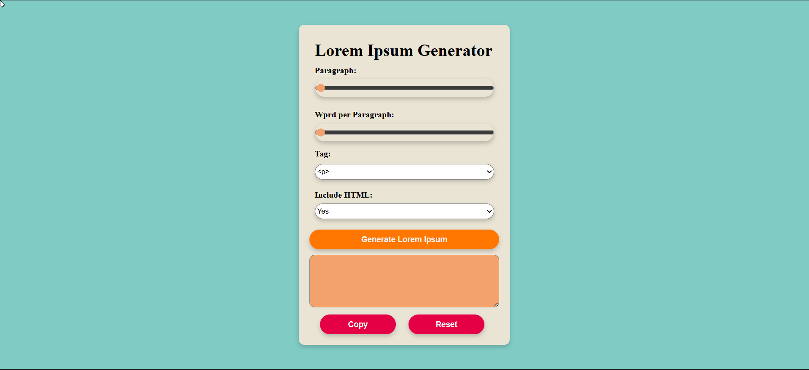

---

````markdown
# Lorem Ipsum Generator

A simple web-based Lorem Ipsum generator that lets you customize the number of paragraphs, words per paragraph, HTML tags, and more — all built with **HTML**, **CSS**, and **JavaScript**.



## 🚀 Features

- Generate random **Lorem Ipsum** text
- Customize:
  - Number of paragraphs
  - Words per paragraph
  - HTML tag wrapping (`<p>`, `<h1>`, etc.)
  - Whether to include HTML tags or just plain text
- Copy the output to clipboard
- Reset all options to default
- Fully responsive layout 

## 📁 Project Structure

```plaintext
/your-project-folder
│
├── index.html          # Main HTML structure
├── style.css           # Styling (customizable)
├── script.js           # Main JavaScript logic
└── README.md           # You're reading it!
````

## 🛠️ How to Use

1. Clone or download this repository.
2. Open `index.html` in your browser.
3. Use the sliders and dropdowns to customize the output.
4. Click `Generate Lorem Ipsum` to generate text.
5. Click `Copy Text` to copy it to clipboard.
6. Click `Reset` to clear all inputs and output.

## ✨ Available HTML Tags

You can wrap the generated text in any of the following tags:

* `p`
* `h1`, `h2`, `h3`, `h4`, `h5`, `h6`
* `span`

These are dynamically populated in the tag dropdown.

## 🔧 Technologies Used

* HTML5
* CSS3
* Vanilla JavaScript

No libraries or frameworks required.

## 🧩 Possible Future Enhancements

* Export to `.txt` or `.html` file
* Light/Dark theme toggle
* More placeholder text themes (tech, startup, pirate, etc.)
* Typing animation
* Character/word counter
* Save user settings to local storage

## 🧑‍💻 Author

* **Manas Ranjan**
* GitHub: (https://github.com/Manasranjan1)
* Email: (mailto:manasranjan9852@gmail.com)

## 📜 License

This project is open source and free to use under the [MIT License](LICENSE).

```


